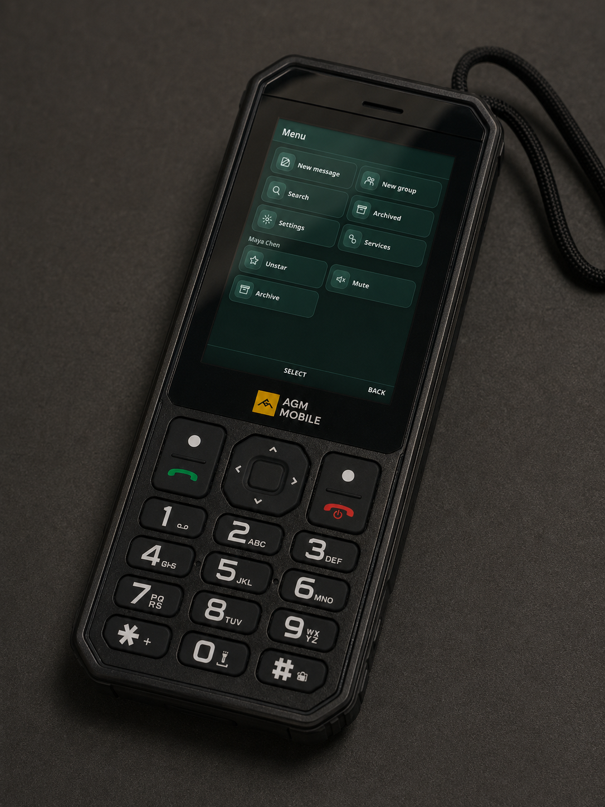
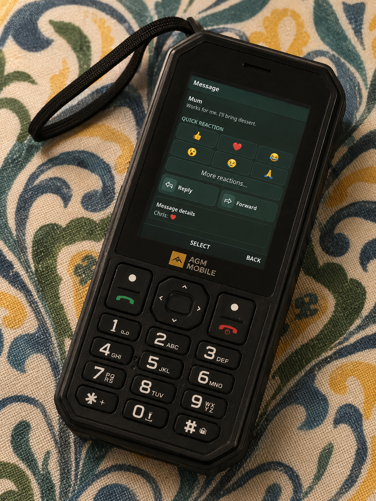
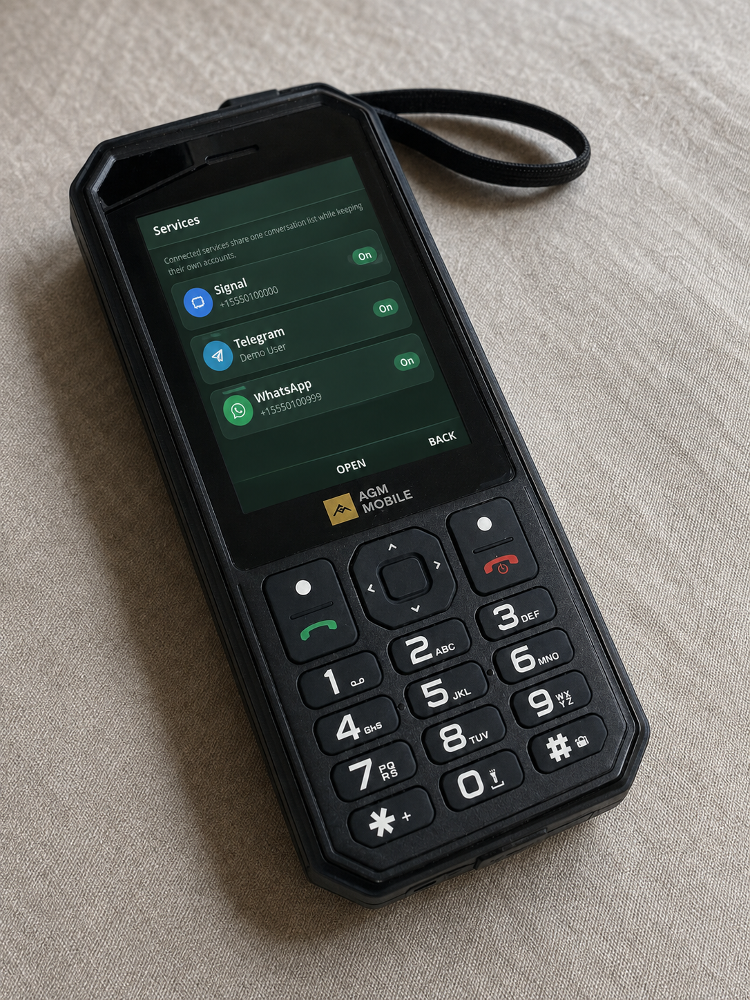
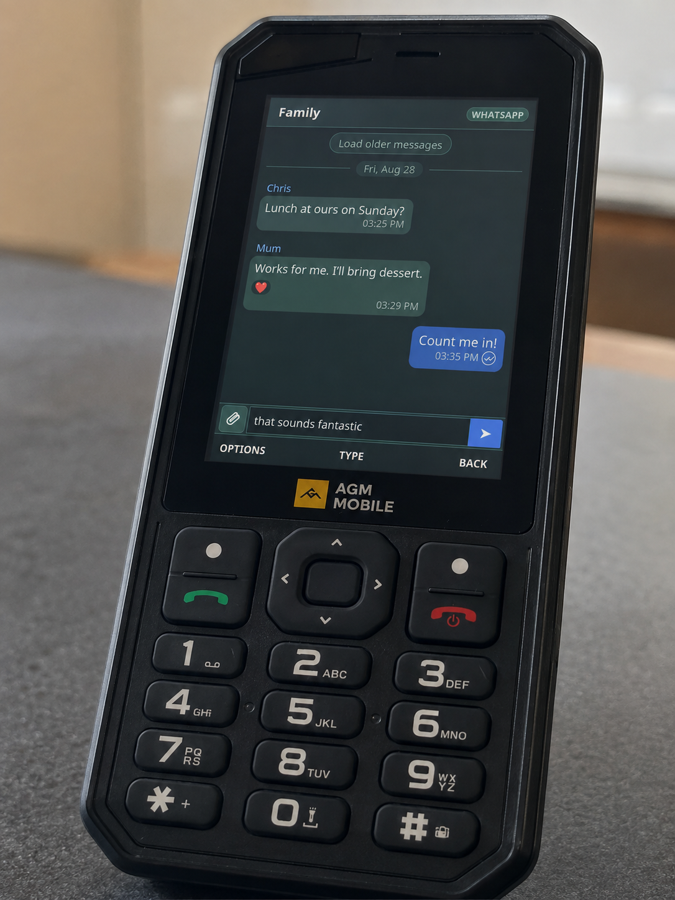

In my [AGM M11 review](/posts/agm-m11-review-for-digital-minimalists/) I mentioned that it was possible to write your own apps for the phone's CloudPhone platform, and that I would come back to it in a future article. I want to highlight such an app I've developed and how it's made the M11 much more useful. It's called [DumbTalk](https://github.com/samtate/dumbtalk), and it puts Signal, Telegram and WhatsApp into one interface designed from the ground up for a 240x320 screen and a D-pad.

The motivation was simple. I love the M11, but most of my actual messages do not arrive by SMS. Carrying an Android phone as well, or moving back to an Android based dumbphone, would rather undermine the point. Android is extremely useful, but that usefulness is also the problem for me. Once I have it in my pocket there is always another justifiable app to install, followed by another, until the dumbphone is doing a fairly convincing impression of the smartphone I wanted to get away from.

> I didn't want a smartphone with a small screen. I wanted a dumbphone which could handle modern messaging.

DumbTalk is my attempt to fill that gap. It is still a communication tool but there is no feed, browser, app store or endless supply of things to look at. I can check whether somebody has messaged me, reply, and put the phone away again.

### Starting with Signal

The first version was called SigDumb and only supported Signal. It was a proof of concept in the truest sense: the entire frontend lived in one enormous vanilla JavaScript file. It directly created chunks of HTML, replaced screens, handled focus, assigned the three soft keys and contained all of the state. The first committed version of `app.js` was already over 500 lines.

It proved an important start though: Signal messages could arrive on a phone which could not install Signal, and the result felt like a native feature phone messenger. Even just navigating by D-Pad instead of being forced to use a touchscreen, as on an Android based dumbphone, was refreshing and helped solidify the retro aesthetic.

CloudPhone apps are web based, although the arrangement is a little unusual. The phone itself does not fetch the page. CloudMosa's servers load it, process the DOM and send a representation of it to the phone. That means the interface has to work within a fairly constrained browser and every interaction needs to make sense with up, down, left, right, centre and two soft keys. It also means the DumbTalk server needs a public HTTPS address. Having the phone and server on the same WiFi does not help because the request never comes from the phone.

This shaped the interface from the beginning. Everything needs to live within a predictable grid type system where it is obvious which D-Pad Key will take you where, without making you scroll past too many things to get to what you want. Every screen needs a predictable first selection, the selected item needs to remain visible, and returning from a menu should put you back where you were. A modal which is only mildly annoying on a smartphone can make an app unusable when the only way out is a key the page forgot to register.



The early app gained replies, reactions, receipts, media, voice notes, group information and the rest surprisingly quickly. It also gained the sort of bug which only becomes obvious when you use the thing as your real messenger. Before I added a visible warning that a conversation had been blocked, I accidentally blocked a group chat. I then spent most of a day wondering why nobody had said anything.



> Dogfooding is very effective when a UI bug can make you think all of your friends have gone quiet.

### Moving to a more robust framework

Telegram was developed alongside Signal, initially as a separate client. That let me get each service working without designing a grand abstraction before I understood either of them. It also meant every new interface feature had to be implemented twice. Add a better reply view to Signal, then add it again to Telegram. Fix message grouping in one client, then remember that the other client still had the old version. Even when the screens looked identical, their data and behaviour were slowly drifting apart.

The proof of concept had done its job, so I rebuilt the frontend in Preact and TypeScript. Preact was a good fit because I wanted components and predictable state. SCSS modules kept the styles local, and the soft keys and focus handling became platform components rather than little pieces of event handling scattered around every screen.

The more important change was a common messaging contract. The interface now deals in universal conversations, messages, attachments, reactions and receipts. Signal, Telegram and WhatsApp each have an adapter which translates between that common model and the service's own terminology and identifiers.

This does not pretend the three services are the same: each adapter reports its capabilities, so DumbTalk can offer an operation where it is supported and hide it where it is not. Signal safety numbers remain a Signal feature. Polls, disappearing messages, edits and other operations can differ between services without filling the shared interface with special cases.

> The unified inbox is shared. The service sessions and all of their peculiarities stay separate.

Signal is connected as a linked device through `signal-cli`. Telegram uses its MTProto API and still needs an API ID and hash before it can link the user's account. WhatsApp uses a linked-device session through `wacli`. These all sit behind the same server and UI, while retaining separate data directories and service specific code.



Adding WhatsApp after that restructuring was much less painful. There was still plenty of service work to do, especially around pairing, synchronisation, receipts and typing events, but I no longer had to build a third copy of the messenger around it. Once its adapter could produce the common types, its conversations appeared beside the others.

The result is one chronological inbox with a small service marker on each chat. Open one and you can read and send text, reply, react, view pictures, play voice messages and use the operations that service supports. It feels like one application, which matters much more on a phone where hopping between three separate apps would be slow and fiddly.



### Why it has to be self-hosted

DumbTalk runs on a server you control. That can be a little computer or NAS at home, or a cheap VPS. I do not offer a hosted version because the server becomes a linked endpoint for your accounts. It stores session keys, receives decrypted messages and caches media. I have no interest in being responsible for other people's private conversations, either ethically or under GDPR.

Self-hosting introduces some setup, but I have tried to remove the unnecessary parts. The Docker image is built automatically for x86-64 and ARM64 and published to Docker Hub. A new installation can be started with Docker Compose, then configured in the browser. It generates its own application data and access key at runtime, so there is no long `.env` file full of secrets to manufacture before the first launch.

The slightly awkward part is giving CloudPhone's servers a public HTTPS URL. Port forwarding is an option, but it is a poor default now that so many home connections sit behind CGNAT. The setup guide covers Tailscale Funnel and Cloudflare Tunnel, along with a conventional reverse proxy or VPS. Both tunnel options can give a home server a public address without opening an inbound router port.

### Authentication

The completed CloudPhone URL looks roughly like this:

```text
https://chat.example.com/#A_VERY_LONG_RANDOM_KEY
```

Putting an access key in a URL deserves an explanation. A normal username and password screen would be miserable to use on a T9 keypad, and CloudPhone needs to launch straight into the app. This is a personal, single-user service, so the random key acts as a bearer credential. The first browser to open a fresh installation claims it and receives a newly generated 256-bit key.

The part after `#` is a URL fragment. Browsers do not send that fragment in the HTTP request, so it does not normally appear in server request logs, DNS queries or referrer headers. DumbTalk's frontend reads it and sends it to the API in an authorisation header. Protected images and media are fetched in the same way rather than being left at public URLs.

There is a clear trade-off: anybody who obtains the complete URL should be treated as having access to the app. It must be stored like a password and kept out of screenshots and issue reports. For this use case I prefer one high entropy URL which CloudPhone can open directly over a login form designed for a full browser. It is a deliberate choice for a personal appliance.

> The URL is effectively the key to the front door. The fragment keeps it out of routine web requests, but it still needs to stay private.

There are other security boundaries too. The server checks the key using constant-time comparison, checks the origin of state-changing requests, applies browser security headers and runs the application processes without root privileges. It has not had a formal third-party security audit, and the machine itself still matters. If somebody can read the DumbTalk data directory, they can potentially read messages and take the linked-device sessions. Backups need the same care as the live server.

### Where AI fitted into the development

I used AI coding tools during the development of DumbTalk. They were particularly useful for producing repetitive adapter code, writing tests, tracing unfamiliar API responses and moving the interface from the original vanilla JavaScript into components at speed.

I have been a software engineer for ten years, and that changed how I used them. I decided the architecture, chose the boundaries between the shared interface and each messaging service, reviewed the code and tested it on the actual hardware. Suggestions were checked against the service behaviour and altered or thrown away where they did not make sense. The boring but important work of deciding what should be trusted, where credentials live, what happens on failure and whether an interaction feels right on a D-pad still required engineering judgement.

This project would have taken me much longer without AI assistance, and frankly these days I have a lot less interest in taking on a multi-week development project in my own time - I code for my job so it's not necessarily my first choice for how to spend time when I clock off.

> AI helped me cover a lot of ground quickly. I still had to know which ground was worth covering.

### A dumbphone I can actually keep using

DumbTalk supports far more than I expected when I started the Signal proof of concept, but I don't really judge it by the number of features. The useful test is whether I can leave home with the M11 and stop wondering if I also need an Android device in my bag.

For me, Telegram, Signal and WhatsApp were the strongest arguments for keeping Android. They are how friends and family already communicate, and asking everybody to move back to SMS for my digital minimalism experiment would be unreasonable.

With those messages on a proper dumbphone, I can still be reached and I can deal with a picture, voice note or group conversation when I need to. The small screen and keypad naturally discourage long, aimless sessions. There is no temptation to leave the messenger and open a browser or social feed because those things are not really part of the device.

It does not support voice or video calls through the messaging services, and CloudPhone does not currently provide push notifications for third-party widgets, which is a shame. I check DumbTalk manually a few times during the day, which happens to suit how I want to use messaging anyway. If CloudPhone adds notification support I plan to add it, ideally without turning the phone back into something which demands attention every few minutes.

There is setup involved, and running a server will never appeal to everybody, but the project is open source and the installation is improving quickly.

The source and setup instructions are on [GitHub](https://github.com/samtate/dumbtalk). It is still young, so bug reports and questions are very welcome. Just please double check that the secret part of your widget URL is not in the screenshot first.
