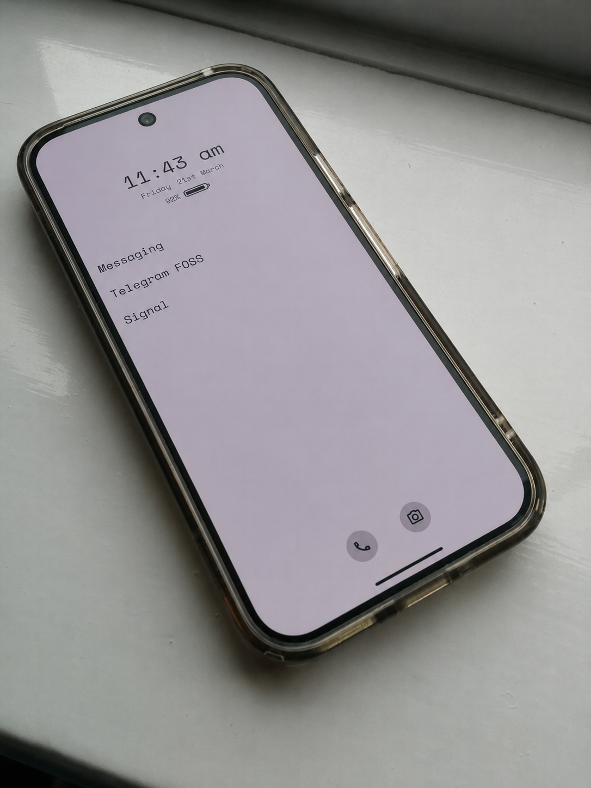
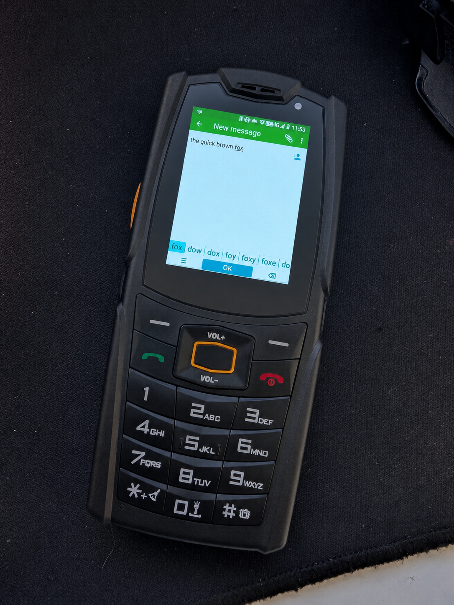
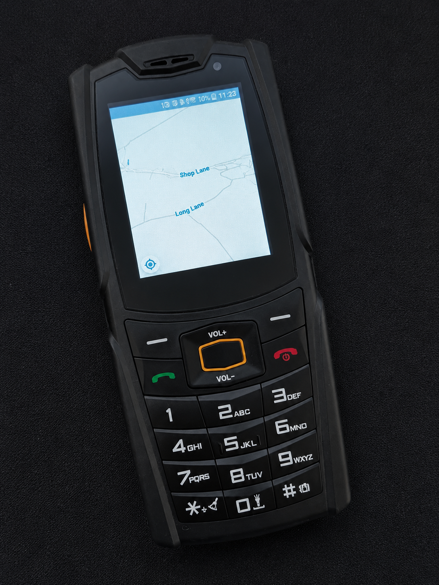
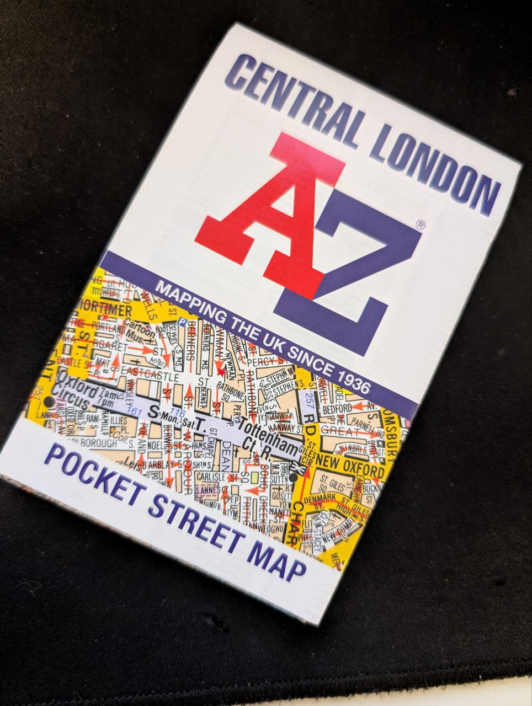
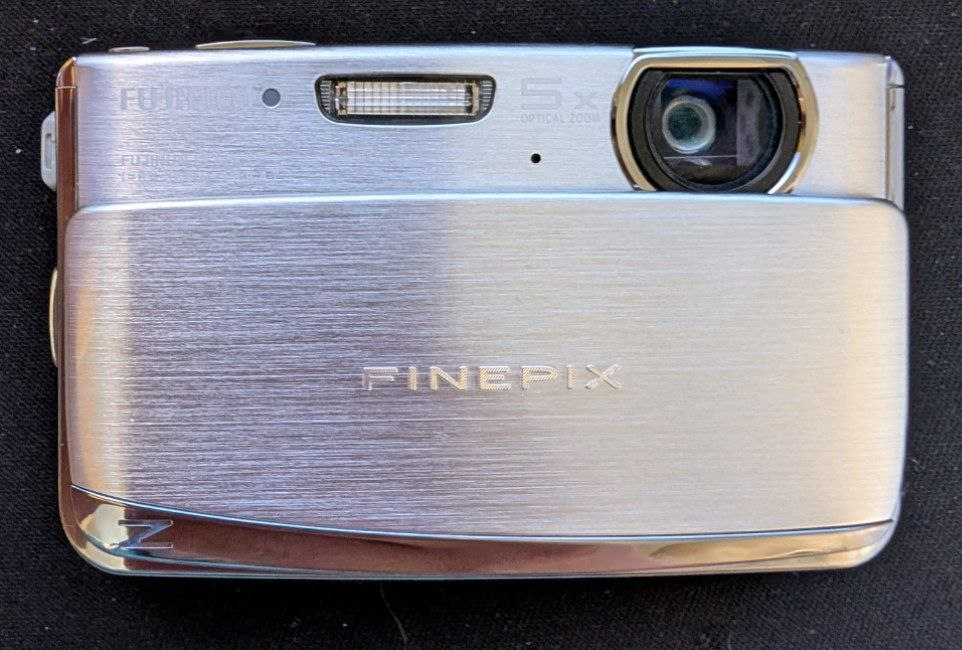
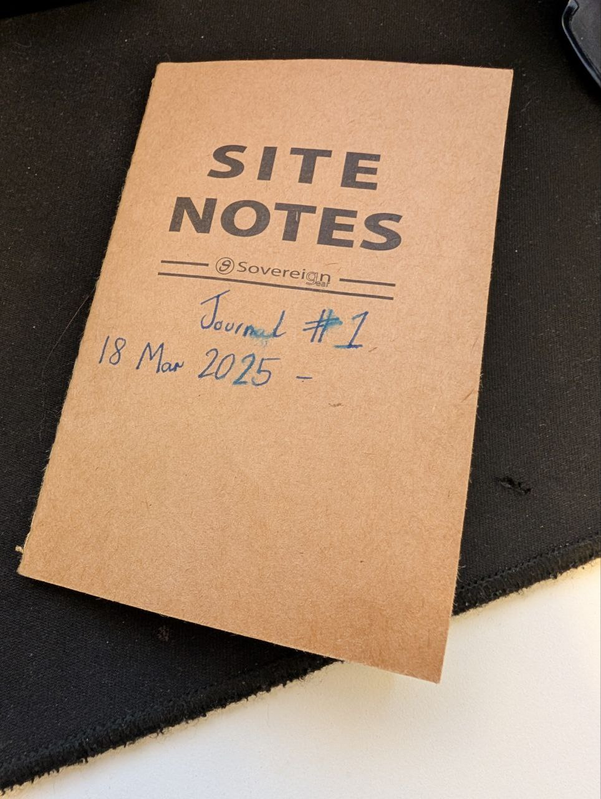
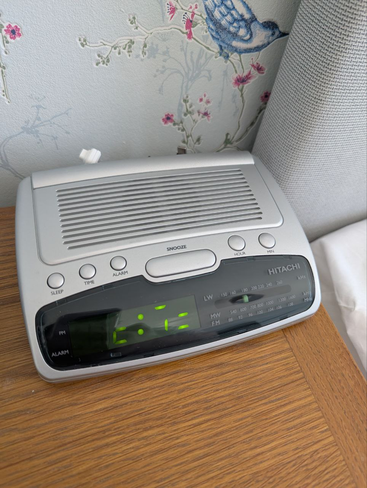

Recently I read the excellent _Digital Minimalism_ by Cal Newport. It really resonated with a lot of what I've been thinking lately: that our phones and other digital devices are increasingly dictating our behaviour as opposed to the other way round. It's now common for folk to no longer experience true "boredom" or solitude as even 30 seconds in a coffee shop queue now has a phone automatically pulled out and scrolling commenced, even without realising you're doing it. I definitely fell into this category. 

While I won't go further than this into the "why" behind the digital minimalism philosophy (the book already does a fantastic job), I wanted to write a little about how I've started to put it into practice. The philosophy has three major principles, summarised here:

* **Principle #1:** “Digital minimalists recognize that cluttering their time and attention with too many devices, apps, and services creates an overall negative cost that can swamp the small benefits that each individual item provides in isolation.”
* **Principle #2:** “Digital minimalists believe that deciding a particular technology supports something they value is only the first step. To truly extract its full potential benefit, it’s necessary to think carefully about how they’ll use the technology.”
* **Principle #3:** “Digital minimalists derive significant satisfaction from their general commitment to being more intentional about how they engage with new technologies. This source of satisfaction is independent of the specific decisions they make and is one of the biggest reasons that minimalism tends to be immensely meaningful to its practitioners.”

Obviously I haven't cut tech out of my life entirely, this would neither be practical nor desirable. But going back to the 2000s concept of the Internet being a single location in the house (the desktop PC), for me, is very compelling. Of course I still have my home servers doing their thing, my connected TVs, but this isn't incompatible with the philosophy as long as I am deliberate with their use in a way that aligns with my goals, rather than mindless scrolling.

One major step I took was "de-smartifying" my smartphone. I uninstalled all but a few essential apps (more on this below), installed a minimalist launcher, and set the screen to greyscale. This made the phone so unappealing to use that my screen time instantly fell to almost nothing.

It was immediately very gratifying to regain control in this way and I increasingly found myself leaving the phone at home for short local errands, runs, walks etc. When on holiday in Jersey recently I went for an 8km run on unfamiliar streets with just my GPS watch in tow in case I got lost, and although I'd never normally check my phone on a run, it was very freeing.

It now seemed superfluous to carry around such an expensive and fragile smartphone for such basic tasks, so wanting to take things further, I decided after much research to order an AGM M7 phone (pictured at the top of the article, and below). This is a rugged and extremely affordable device in a "dumbphone" form factor with a T9 keypad, however the real benefit is that it runs Android. This means that you can still install some of the apps that are somewhat essential for modern life, but due to the tiny screen, low resolution, and somewhat slow CPU, anything other than essential usage is heavily discouraged. I also like the retro aesthetic and it is a bit of a conversation starter, which may be a pro or a con depending on your outlook.

The phone has modern features like supporting 4G and VoLTE which will be essential when 2G is shut off in the UK in the coming years (most traditional dumbphones will cease to work at that time: 3G has already been largely turned off). And it has some practical features that even my smartphone didn't have: it has an IP69K rating which rates it for high pressure water jets and dust, and can withstand pretty much any drop. The bright torch is conveniently located on the top and can be turned on with a keypress even when the screen is off, and the massive 3.5W speaker on the back is comparable in volume and quality to a small Bluetooth speaker: far outperforming any other phone I've ever heard. The T9 keypad is clicky and responsive and works very well: I was surprised how quickly I regained typing speed on it having not used one for over 15 years, but of course it isn't intended for typing long messages on, which helps me to be concise with messages, either opting to wait until I'm on a desktop PC later, or just hop on a call.

Now I'll outline some of the use cases and how I've addressed them. All of the below is developing after only a few weeks of doing things this way: I imagine I'll change many things over time.

### Phone / Messaging

One point that is hammered home in Newport's book is that instant messaging is not a subsitute for actual human conversation, be it face to face, video call, or voice call. There are subtleties in vocal and facial movements which cannot be replicated. Newport posits that text communications do not develop a relationship and are often used instead of actual conversations: he recommends that instead text communication is kept to a minimum: to relay essential info, and to set up actual conversations. As such, while I have Telegram and Signal installed on the M7, they have notifications off and I try to only check them a few times a day, often on my PC which is more convenient. Friends and family know that to access me instantly they can phone. I had a friend phone the other day for the first time in years and it was very refreshing.

### Travel

Luckily the AGM M7 has GPS and runs the excellent _Magic Earth_ app flawlessly. This uses crowdsourced OpenStreetMap data with traffic, roadworks, and public transport info overlaid. However, while this is always an option when I need it, I have been trying to be more intentional with my navigation. I find following a GPS blindly leads to a lesser understanding of your local area, which streets lead where etc. I picked up a couple of cheap paper maps of some places I commonly find myself and try to use these occasionally. 

Additionally, I try to look up directions beforehand on my PC and either remember them or write down some key POIs. I do the same for public transport: look up my bus time in advance, and check the timetable at the stop for my return journey. Of course, Magic Earth is only a tap away if anything doesn't go to plan, so I'm never at risk of being lost.

Train tickets can be purchased at ticket machines, or for journeys where advance bookings save money, they can be purchased online and printed out at stations. My 26-30 railcard (digital only sadly, no option for a physical card which would be my preference) can be downloaded to the Trainline app and displayed on the phone.

### Photos

The cameras on the AGM M7 are fairly dire: they are mainly useful for scanning QR codes to sign into the Signal or Starling desktop app etc. They can be used for sending a quick snap to a Signal chat (think "which of these items at the shop do you want?") but otherwise they're best ignored.

I have a cheap Fujifilm Finepix Z70 from yesteryear which, while I don't carry every day, is compact, fun to use, and takes decent photos with a great 5x optical zoom. This may be the biggest downside of this experiment as both the quality and convenience are not there compared to a smartphone. Again however, it may help be more intentional. Everyday beauty (a sunset, a cherry blossom) can be appreciated in the moment, and where I know I will want to take photos, it's no effort to slip the camera into my pocket.

However, this is definitely the biggest downside to this I've found so far, and may be a reason for many people to stick with a dumbed down smartphone rather than a "dumbphone".

### Notes, Habit Tracking, and Browser

This is another area I'm evolving over time. My phone has no browser installed, deliberately. Anything I want to look up during the day, I can write in the notepad and look up at home later. Additionally I can jot things down here I may need later such as a phone number for a hotel, brief directions or bus times, etc. I also use the notebook for calorie tracking (actually easier than messing around with scanning barcodes in an app), and gym log tracking (i.e. the number of reps at what weight, so I can progress over time). 

At the moment, this is quite chaotic as I have no system, so I plan to look more into Bullet Journaling to try and give more structure to the notebook.

### Email

I deliberately left an email app off my phone to reduce distraction. It's extremely rare I receive an email that can't wait until the evening to be replied to. Emails with QR codes or collection codes to pick orders up, or to print train tickets at the station, can be printed, or the codes written in the notepad.

### Spending

This one is easy. In lieu of Google Pay (which I haven't used for years anyway), I just carry a card and some cash. Voila, I can purchase things. I like cash as it can make you more mindful of your spending through inconvenience (noticed a theme in this article yet?). If you only have a crisp £20 note, do you really need a £3.20 coffee that'll give you shrapnel of change in return? I also have a NFC ring I wear at all times with a small amount loaded onto it for emergencies if I go out without my card or cash, such as a bus fare or similar. I use it so infrequently I forget it's an option until I really need it, which helps prevent everday spending from happening on it.

### Alarm

Another easy one. This digital alarm radio was just £2 on Facebook marketplace (I looked up the address before leaving and got there without looking at my phone...) and works great. The display looks odd on camera but great in person. It wakes me up either with a buzzer, or a radio station. Sadly it's an FM/AM radio as opposed to internet or DAB and most of those stations seem to be being sunset in my area: I've found Capital is the least objectionable in the 6:58 - 7:03 period it's on.

This means I can charge my phone in my office, so I don't have the temptation to scroll last thing before bed or first thing in the morning.

## Free time

Of course, all of this reduction in scrolling means a lot more free time which is somewhat of a superpower. I'd already been running and going to the gym regularly so these continue to take up a lot of my spare time, and I still find them incredibly rewarding, however I have just joined a local running club for a more social side of things which I hope to attend soon.

Additionally I've got really into reading: I hadn't read at any meaningful frequency for 10 years, whereas now I'm finishing a book every couple of days. So far I'm enjoying non-fiction books: a recent read I enjoyed was _How to be Right_ by James O'Brien which had been sitting on my shelf for 5+ years. I imagine I'll have an itch for some Pratchett or Christie soon though.

I'm still working out what I can do with more of my free time now I've got it: YouTube and browsing the web on my PC (no social media other than Bluesky) still take up a reasonable amount of my time.

## Conclusion

I hadn't expected a single book to change my outlook on life so radically. While this is all still very new to me and evolving over time, I do think I prefer things now, despite the perceived "inconveniences". As Newport states: eliminating these minor "inconveniences" like having to get paper tickets, not having a browser in your pocket, having to carry a separate camera, etc, is not worth it if it means overwheming yourself with all the negatives of a smartphone.

I'm sure some people are perfectly capable of enjoying the benefits of a modern smartphone without any of the drawbacks, and are currently thinking I've become a bit of an odd luddite (I refute the latter, perhaps not the former :D ), but I am not able to, and looking at screen time stats of the average person, I posit that most people are not able to either.
